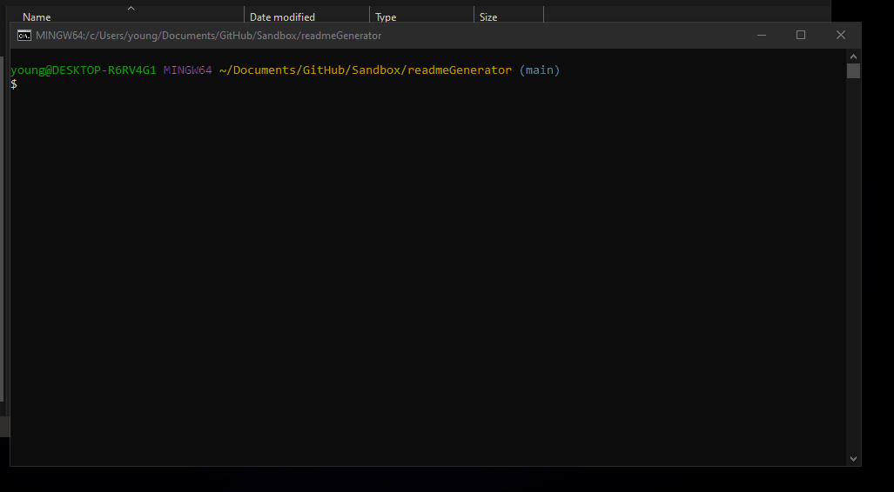

# Read Me Generator

User can run index.js via node in order to answer a series of questions and generates a readme in folder with contents plugged into a pre-generated format with user's input.

## Demo

  
## Lessons Learned

The coding part of it was simple enough in hindsight, but wrapping my head around the "backend" portion of the course took a bit to wrap my head around. I eventually understood how all the packages and script files work with each other to act as a cool readme generator. It is rudimentary but gets the job done!
  
## Deployment

No deployment link here, see the included gif for demonstration.

  